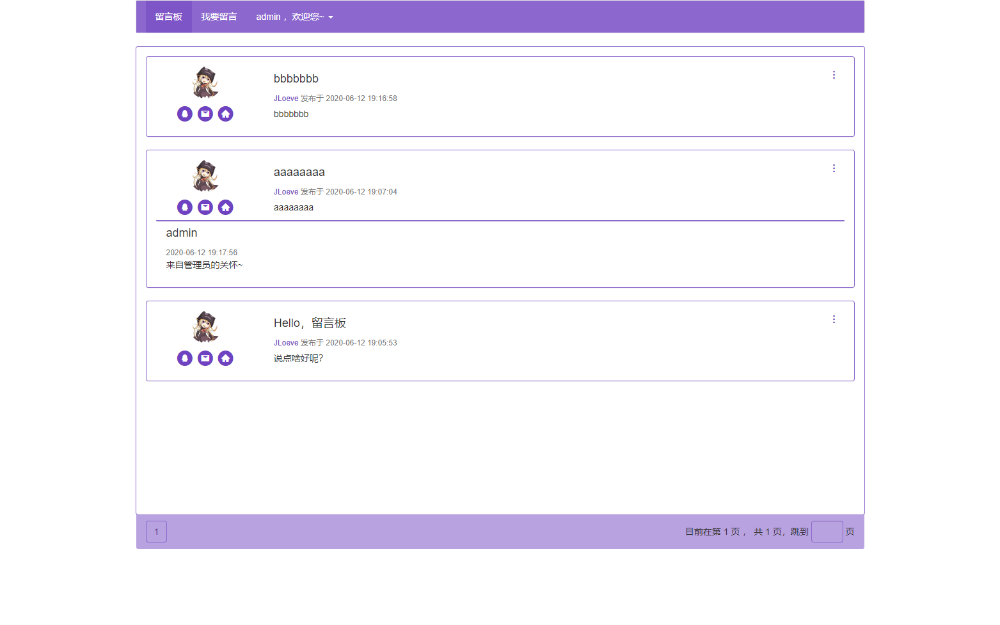

# 简易留言板

## 截图

## 特性

- 电脑端/手机端响应式布局
- 管理员可对留言进行删除/回复操作

## Docker 支持

### 环境变量

|  名称   |    默认值     |              含义              |
| :-----: | :-----------: | :----------------------------: |
| DB_NAME | message_board |           数据库名称           |
| DB_ARRD |   127.0.0.1   |        数据库的主机地址        |
| DB_USER |     admin     |         数据库的用户名         |
| DB_PASS |    example    |          数据库的密码          |
| DB_TYPE |     mysql     | 数据库的类型，目前只支持 mysql |

## TODO

- [ ] 实现管理员注册功能（重新设计用户系统）
- [ ] 支持设定数据库的端口
